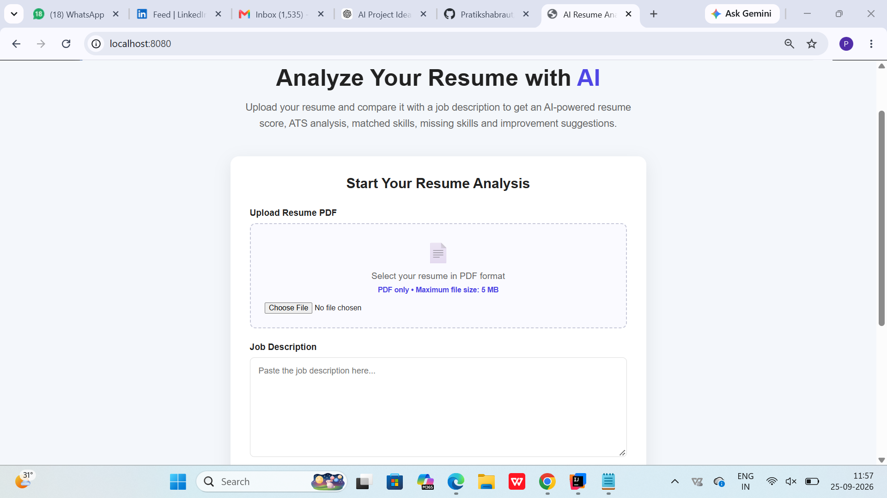
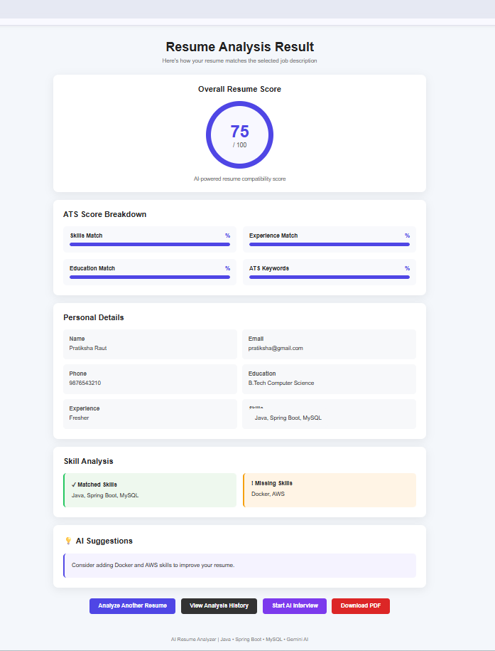
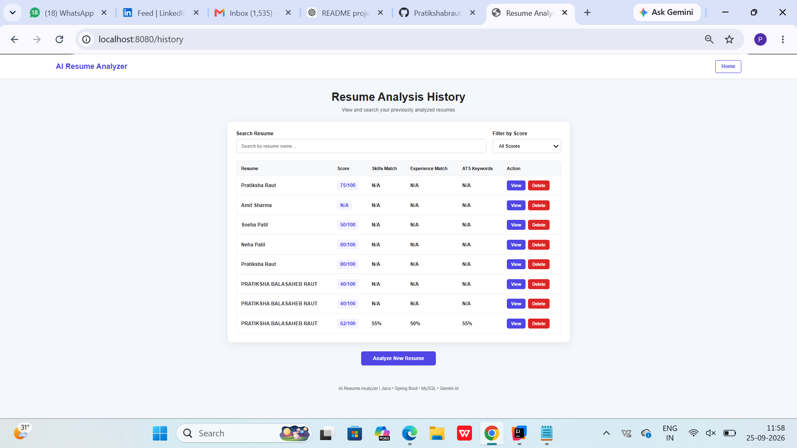
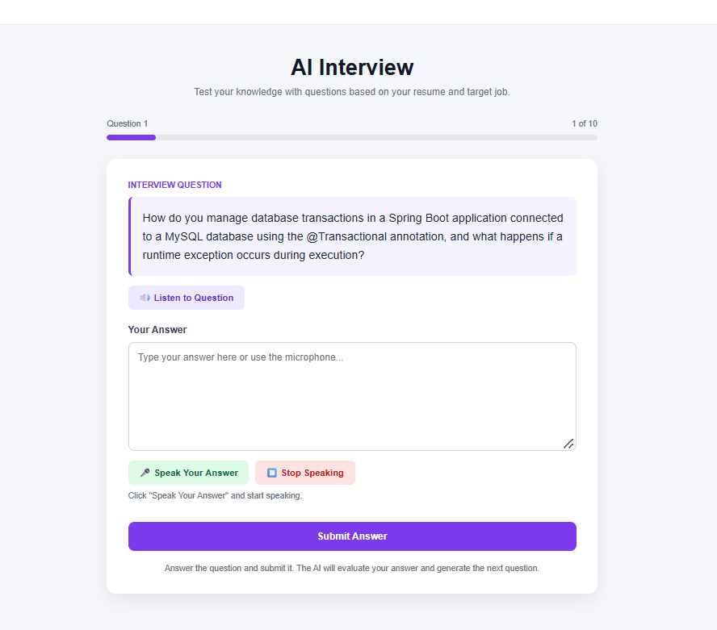

# 👋 Hi, I'm Pratiksha Raut

  

  <b>💻 Code • 🤖 Learn • 🚀 Build • 🌱 Grow</b>

---

## 🌸 About Me

🎓 Computer Science Student passionate about software development.

☕ Learning **Java, Spring Boot & Data Structures**.

🤖 Exploring **Machine Learning & Artificial Intelligence**.

🗄️ Working with **MySQL & SQL**.

🚀 Building real-world projects and learning every day.

---

## 🛠️ Tech Stack

---

# 🚀 Featured Projects

## 🤖 AI Resume Analyzer

AI-powered resume analyzer that compares a resume with a job description and provides useful career insights.

**Features:**

📄 Resume Upload • 📊 Resume Score • 🎯 ATS Analysis • ✅ Matched Skills • ❌ Missing Skills • 💡 AI Suggestions • 📚 History • 🤖 AI Interview

### 📸 Project Preview

  
  

  
  

---

## 🌱 Crop Maturity Detection

Deep learning project for detecting maturity stages of **tomatoes and dragon fruits**.

**Tech:** `Python` `TensorFlow` `Deep Learning` `Computer Vision`

---

## 🧠 Deepfake Detection

Machine learning project for detecting **machine-generated social media content**.

**Tech:** `Python` `FastText` `CNN` `LSTM` `TensorFlow`

---

## 🌾 Farm Management System

Java + MySQL application for managing farmers, products and farm information.

**Tech:** `Java` `MySQL` `NetBeans`

---

## 👕 SwapNStyle

Clothing reselling platform where users can list, search, purchase and review products.

**Tech:** `PHP` `MySQL` `HTML` `CSS` `XAMPP`

---

## 📚 Currently Learning

☕ Java &nbsp; • &nbsp;
🌱 Spring Boot &nbsp; • &nbsp;
🧩 DSA &nbsp; • &nbsp;
🗄️ SQL &nbsp; • &nbsp;
🤖 Machine Learning

---

## 🎯 My Goal

---

## 📊 GitHub Stats

---

## 📫 Let's Connect

---

⭐ <b>Thanks for visiting my profile!</b> ⭐

